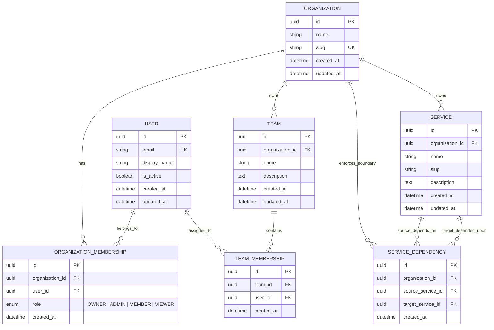
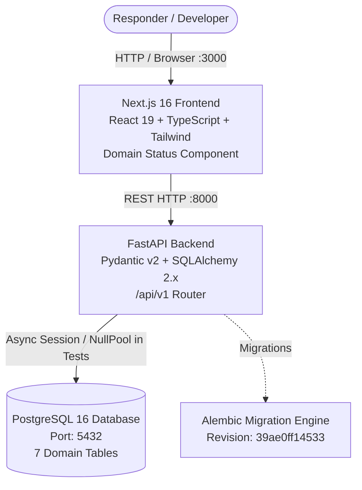

# IncidentHub System Architecture

## 1. Executive Summary & Vision

**IncidentHub** is an incident intelligence and response workspace focused on reconstructing operational incidents as **temporal evidence stories**, moving far beyond conventional ticket or incident CRUD workflows.

When a complex incident unfolds, responders must rapidly reason across disparate signals:
- What happened and in what order?
- What was the system state before and during the disruption?
- What configuration, deployment, or infrastructure changes occurred?
- What evidence (logs, metrics, alerts, traces, customer reports) was observed?
- What hypotheses did responders formulate, test, or reject?
- What decisions were made, what actions were taken, and what were the subsequent consequences?
- How can the incident be reconstructed and replayed deterministically for postmortems and continuous learning?

IncidentHub structures incidents around an **"Incident Story"** graph rather than static status fields.

---

## 2. Architecture Principles

IncidentHub is architected as a **modular monolith**:
1. **Unified Core, Clear Module Boundaries**: Business logic is encapsulated in well-defined backend modules rather than distributed across premature microservices.
2. **Backend as Source of Truth**: All domain logic, validation, evidence relationship rules, and authorization reside strictly in the backend service. The frontend never enforces trusted business constraints.
3. **Environment-Driven Configuration**: Zero hardcoded secrets or environment assumptions. All credentials and network endpoints are injected via standard environment variables.
4. **PostgreSQL as Canonical Source of Truth**: Avoid external graph databases or multi-database sprawl. PostgreSQL handles relational hierarchies, graph structures, vector search (`pgvector`), and JSON telemetry.
5. **Incremental Evolutionary Design**: Foundation technologies are installed and verified first; advanced subsystems are integrated milestone-by-milestone as domain models demand them.

---

## 3. Core Domain Model (Milestone 2 Foundation)

Milestone 2 establishes the relational domain foundation for multi-tenancy, service topologies, and team structures.



### Domain Entities Summary

1. **Organization (`organizations`)**: Primary multi-tenant boundary. Enforces isolated ownership of teams, services, and dependencies.
2. **User (`users`)**: Global platform user with normalized, lowercase unique email. (Authentication is deferred to subsequent milestones).
3. **OrganizationMembership (`organization_memberships`)**: Links users to organizations with assigned roles (`OWNER`, `ADMIN`, `MEMBER`, `VIEWER`). Unique per `(organization_id, user_id)`.
4. **Team (`teams`)**: Organizational squad or response team. Names are unique per organization.
5. **TeamMembership (`team_memberships`)**: Assigns users to teams. Enforces that users must belong to the organization before joining a team.
6. **Service (`services`)**: Represents an operational software component or microservice. Slug is unique per organization.
7. **ServiceDependency (`service_dependencies`)**: Directed dependency edge (`source_service_id` depends on `target_service_id`). Enforces:
   - No self-dependency (`source != target`).
   - Composite foreign keys guarantee both services belong to the same organization at the database engine level.
   - Unique `(source_service_id, target_service_id)` prevents duplicate relationships.

---

## 4. Multi-Tenancy & Referential Integrity

IncidentHub adopts an **Organization-Centric Multi-Tenancy** model:
- All tenant-owned tables carry explicit `organization_id` foreign keys with cascade deletions.
- Cross-tenant service dependencies are prevented both at the application service layer and through composite foreign keys:
  ```sql
  FOREIGN KEY (source_service_id, organization_id) REFERENCES services(id, organization_id)
  FOREIGN KEY (target_service_id, organization_id) REFERENCES services(id, organization_id)
  ```
- This architecture allows future authorization layers to cleanly verify:
  $$\text{User} \longrightarrow \text{OrganizationMembership} \longrightarrow \text{Organization-Scoped Resource}$$

---

## 5. Preparation for the Temporal Incident Graph

The core domain foundation serves as the bedrock for upcoming milestones:
1. **Temporal System Graph**: `Service` nodes and `ServiceDependency` edges form the baseline topology. When incidents occur, telemetry, deployments, and state changes link directly to services.
2. **Incident Stories**: An incident links to the affected service and the accountable team, immediately identifying downstream dependencies and potential blast radius.
3. **Incident Replay**: Deterministic reconstruction can traverse the topology graph at specific timestamps to show the exact state of dependencies during an operational crisis.

---

## 6. Current Component Stack



---

## 7. Planned Components & Evolution Roadmap

| Component | Status | Target Milestone | Purpose & Architectural Role |
| :--- | :--- | :--- | :--- |
| **Core Domain Models** | **Complete** | **Milestone 2** | Organizations, Users, Memberships, Teams, Services, Service Dependencies |
| **Authentication & RBAC** | *Planned* | Milestone 3 | Identity management, JWT/OAuth tokens, role-based authorization guards |
| **Incident Models & Story Timeline** | *Planned* | Milestone 3 / 4 | Incidents, timeline events, state changes, evidence nodes, hypotheses, actions |
| **Redis & WebSockets** | *Planned* | Milestone 4 | Live collaborative incident updates and pub/sub events |
| **Celery Worker** | *Planned* | Milestone 4 | Asynchronous background processing (telemetry parsing, webhook ingestion) |
| **React Flow Graph Editor** | *Planned* | Milestone 4 / 5 | Interactive visualization of service topology and incident evidence chains |
| **pgvector Similarity Search** | *Planned* | Milestone 5 | Semantic search across historical incidents, postmortems, and runbooks |
| **Deterministic Incident Replay** | *Planned* | Milestone 5 / 6 | Time-travel scrubbing through incident progression and system state changes |

---

## 8. Security & Governance

- **Zero Passwords in Milestone 2**: Domain models focus strictly on identity relations; password hashing and credentials will be introduced in the Authentication milestone.
- **Strict Tenant Boundaries**: Database constraints and service-layer validation prevent cross-organization operations.
- **UUID Primary Keys**: Prevents enumeration attacks across all entities.
- **Input Validation**: Pydantic v2 validates UUIDs, email normalization, string boundaries, and regex patterns.
