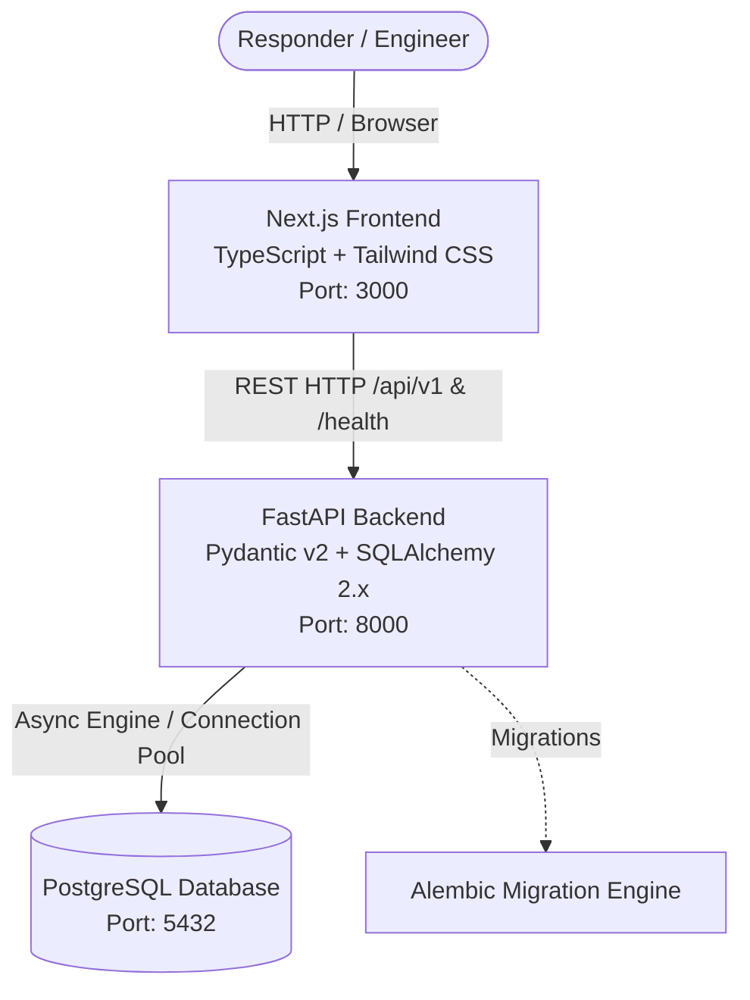

# IncidentHub System Architecture

## 1. Executive Summary & Vision

**IncidentHub** is an incident intelligence and response workspace focused on reconstructing operational incidents as **temporal evidence stories**, moving far beyond conventional ticket or incident CRUD workflows.

When a complex incident unfolds, responders must rapidly reason across disparate signals:
- What happened and in what order?
- What was the system state before and during the disruption?
- What configuration, deployment, or infrastructure changes occurred?
- What evidence (logs, metrics, alerts, traces, customer reports) was observed?
- What hypotheses did responders formulate, test, or reject?
- What decisions were made, what actions were taken, and what were the subsequent consequences?
- How can the incident be reconstructed and replayed deterministically for postmortems and continuous learning?

IncidentHub structures incidents around an **"Incident Story"** graph rather than static status fields.

---

## 2. Architecture Principles

IncidentHub is architected as a **modular monolith**:
1. **Unified Core, Clear Module Boundaries**: Business logic is encapsulated in well-defined backend modules rather than distributed across premature microservices.
2. **Backend as Source of Truth**: All domain logic, validation, evidence relationship rules, and authorization reside strictly in the backend service. The frontend never enforces trusted business constraints.
3. **Environment-Driven Configuration**: Zero hardcoded secrets or environment assumptions. All credentials and network endpoints are injected via standard environment variables.
4. **Incremental Evolutionary Design**: Foundation technologies are installed and verified first; advanced subsystems are integrated milestone-by-milestone as domain models demand them.

---

## 3. Current Architecture (Milestone 1: Foundation)

In Milestone 1, the foundational infrastructure and service skeletons are established to enable independent local development, containerized execution, and automated testing.

### Component Details

#### Frontend (`/frontend`)
- **Framework**: Next.js (App Router) + React
- **Language**: TypeScript
- **Styling**: Tailwind CSS
- **Role**: Lightweight, responsive user interface communicating the project identity, showing live foundation status, and preparing the component hierarchy.
- **Port**: `3000`

#### Backend (`/backend`)
- **Framework**: FastAPI
- **Data Validation & Settings**: Pydantic v2, Pydantic-Settings
- **ORM & Data Access**: SQLAlchemy 2.x (Asyncpg engine + Session maker)
- **Migrations**: Alembic (configured with dynamic settings and `DeclarativeBase`)
- **API Routing**:
  - `GET /health`: Top-level operational health check returning `{"status": "ok"}`
  - `/api/v1/*`: Versioned API router namespace (prepared for future domain endpoints)
- **Testing & Quality**: Pytest with `httpx` async test client, Ruff linter/formatter, MyPy type checker.
- **Port**: `8000`

#### Database (`PostgreSQL`)
- **Engine**: PostgreSQL 16+
- **Connectivity**: Environment-driven connection string (`DATABASE_URL` or individual `POSTGRES_*` variables)
- **Schema State**: Foundation initialized with SQLAlchemy 2.0 Base class and Alembic configuration. No business domain tables created in Milestone 1.
- **Port**: `5432`

#### Development Infrastructure (`docker-compose.yml`)
- Provides containerized orchestrations for `frontend`, `backend`, and `postgres` on a shared Docker bridge network (`incidenthub-network`).
- Health checks for database readiness ensure reliable dependency startup.

---

## 4. Planned Components & Evolution Roadmap

The following components are **PLANNED** for subsequent milestones and are intentionally omitted from Milestone 1 to avoid premature complexity:

| Component | Status | Target Milestone | Purpose & Architectural Role |
| :--- | :--- | :--- | :--- |
| **pgvector** | *Planned* | Milestone 2 / 3 | Vector embeddings for similarity search across incident evidence, past postmortems, and runbooks. |
| **Domain Models & Tables** | *Planned* | Milestone 2 | Incidents, Timeline Events, Evidence Nodes, Hypotheses, Decisions, and Action logs. |
| **Redis** | *Planned* | Milestone 3 | Ephemeral caching, pub/sub for live responder updates, and Celery task broker. |
| **Celery Worker** | *Planned* | Milestone 3 | Asynchronous background processing (telemetry ingestion, evidence parsing, report generation). |
| **WebSockets** | *Planned* | Milestone 3 | Real-time bi-directional collaborative timeline updates between responders. |
| **React Flow Canvas** | *Planned* | Milestone 4 | Interactive visual graph editor for incident evidence, causal chains, and decision trees. |
| **TanStack Query & Zustand** | *Planned* | Milestone 2 / 3 | Robust frontend server cache synchronization and client-side timeline state management. |
| **Temporal Replay Engine** | *Planned* | Milestone 5 | Deterministic reconstruction engine enabling time-travel scrubbing through incident evolution. |
| **OpenTelemetry / Prometheus / Grafana** | *Planned* | Milestone 5 | Distributed tracing, application performance metrics, and operational dashboards. |
| **Authentication & RBAC** | *Planned* | Milestone 2 / 3 | Tenant isolation, OAuth2/OIDC, and role-based access control. |

---

## 5. Security & Governance

- **Credential Hygiene**: No secrets, passwords, or tokens are committed to source control. `.env.example` templates document variable contracts with safe defaults.
- **Root .gitignore**: Configured to reject local `.env` files, virtual environments, build artifacts, and OS files.
- **CORS Configuration**: Controlled via `BACKEND_CORS_ORIGINS` setting, preventing unauthorized cross-origin requests.
- **Database Access**: Backend communicates through scoped credentials; direct database exposure is restricted in production designs.
